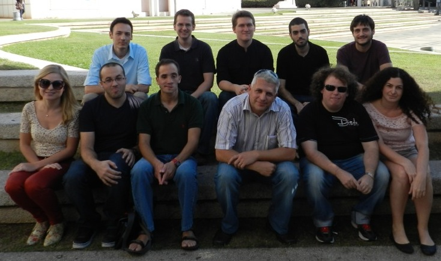

<!-- 

November 2012. Left to right:
Top row: Mark Baevsky, Zachary Taylor, Lon Cherryholmes, Avi Friedman, Alon Sussmann.
Bottom row: Katya Talmor, Erez Wenger (R.I.P), Yosef Meller, Alex Liberzon, Hadar Biran, Hadar Traugott
Missing: Hadar Ben Gida, Youry Borisenkov, Dina Bass -->

### Successful research is a teamwork

### Faculty
* [Alex Liberzon](people/alex_lab.html), Head (Associate Prof.)

### Lab Engineer
* Gregory Gulitski, Ph.D.

### Ph.D. students
* [Lilly Verso](people/lilly_verso.html)
* [Ron Shnapp](people/ron_shnapp.html)
* [Hadar Traugott](people/hadar_traugott.html), together with Dr. Alex Golberg, Porter School of Environmental Studies
* [Marco Boetti](people/marco-boetti.html), COMPLETE International Training Network
* [Yoav Kessler](people/yoav_kessler.html), together with Prof. Slava Krylov
* [Meiron Zollmann](people/meiron_zollmann.html), on a direct track to Ph.D., together with Dr. Alex Golberg, Porter School of Environmental Studies
* [Yiftach Golov](people/yiftach_golov.html), Ph.D. in the Porter School of Environmental Studies, with Prof. Shlomo Margel (Bar Ilan) and 
Prof. Ally Harari (Volcani)

### M.Sc. students
* [Barak Even Chen](people/barak_even_chen.html), together with Prof. Idit Avrahami
* [Shirly Steinlauf](people/shirly_steinlauf.html), together with Prof. Idit Avrahami
* [Lior Chertkow](people/lior_chertkow.html) in collaboration with Prof. Avi Seifert laboratory
* [Sabrina Shlain](people/sabrina_shlain.html), Tel Aviv University
* [Tomer Ast](people/tomer_ast.html), Tel Aviv University

### Undergraduate research assistants

* [Noam Benelli](people/noam_benelli.html)

### Alumni
* Ephi Ezri, M.Sc. Graduated 2008
* [Assaf Barel](http://il.linkedin.com/pub/assaf-barel/7/364/686), M.Sc. Graduated 2008
* Eduard Patlakh, M.Sc. Graduated 2008 [backup](people/eduard_patlakh.html)
* [Michael Degtyar](http://il.linkedin.com/in/michaeldegtyar), B.Sc. Graduated 2009 [backup](people/michael_degtyar.html)
* [Maya Beckerman](people/maya_beckerman.html), B.Sc. Graduated 2010
* Danny Sorkin, B.Sc. Graduated 2010
* [Roman Povolotsky](http://il.linkedin.com/pub/roman-povolotsky/19/442/782), B.Sc. Graduated 2010 [backup](people/roman_povolotsky.html)
* [Eldad Sumnon](people/eldad_sumnon.html), B.Sc. Graduated 2009
* [Reut (Elfassi) Kamer](https://www.linkedin.com/in/reut-kamer-3973b620), M.Sc. Graduated Jan. 2010 [backup](people/reut_elfassi.html)
* [David Ratner](http://il.linkedin.com/pub/david-ratner/4/a98/140), M.Sc. Graduated Nov. 2010 [backup](people/david_ratner.html)
* [Mark Kreizer](http://il.linkedin.com/pub/mark-kreizer/9/36/464), M.Sc. Graduated Feb. 2011 [backup](people/mark_kreizer.html)
* [Tracey Hayse](http://www.linkedin.com/in/traceyhayse), MITSI program, 2011 [backup](people/tracey.html)
* [Tyler Mehrman](http://zetapsi.mit.edu/brothers/11/), MISTI program, 2012
* [Dikla Kersh](http://il.linkedin.com/pub/dikla-kersh/14/85b/27), M.Sc. Graduated Nov. 2012 [backup](people/dikla_kersh.html)
* [Lon T. Cherryholmes](people/lon.html), B.Sc., graduated 2013
* [Katya Talmor](people/katya_talmor.html), B.Sc., graduated 2013
* [Alon Sussmann](https://www.linkedin.com/in/alon-sussmann-23912866), 2012, [backup](people/alon_sussmann.html)
* [Dina Bass](https://www.linkedin.com/in/dina-bass-96269288), Graduated B.Sc. Biomedical Engineering, Sep. 2013
* [Zachary Taylor, Ph.D.](people/zach.html), ex-postdoc, Wind Energy Research Center, Canada
* [Erez Wenger](people/erez_wenger.html), (R.I.P.) changed his topic to Solar Energy in September 2013.
* [Hadar Ben Gida](https://www.linkedin.com/in/hadar-ben-gida-b0aa98a7), co-supervised with Dr. Roi Gurka, graduated May 2013 [backup](people/hadar_ben_gida.html)
* [Yitzchak Shuman](people/yitzchak_shuman.html), co-supervised with Prof. Slava Krylov
* [Shlomo Markman](people/shlomo_markman.html)
* [David Altura](people/david_altura.html), co-supervised with Prof. Neima Brauner
* [Hadar Traugott](people/hadar_traugott.html), [Dead Sea Works](http://en.wikipedia.org/wiki/Dead_Sea_Works)
* [Alexander Hinterberger](people/alexander_hinterberger.html), Vienna Technical University, Austria.
* [Barak Glassman](people/barak_glassman.html)
* [Avi Friedman](people/avi_friedman.html), co-supervised with Dr. Gabor Kosa
* [Mark Baevsky](people/mark_baevsky.html), XJet
* [Hadar Biran](people/hadar_biran.html), co-supervised with Dr. Idit Avrahami
* [Lisa Yang](people/lisa_yang.html), [MIT-Israel program](http://misti.mit.edu/mit-israel)
* [Sarah Berdugo](people/sarah_berdugo.html), Pierre et Marie Curie University, Paris
* [Nimrod Daniel](people/nimrod_daniel.html)
* [Shaily Wald](people/shaily_wald.html), completed M.Sc. in 2017, supervised together with Prof. Idit Avrahami
* [Omer Luria](people/omer_luria.html), Tel Aviv University
* [Daniel Bar](people/daniel_bar.html), Tel Aviv University
* [Meny Kon](people/meny_kon.html)
* [Oz Habiby](people/oz_habiby.html), together with Dr. Alex Golberg, Porter School of Environmental Studies, 2018
* [Yosef Meller](people/yosef_meller.html), Stratasys, graduated 2018

### A lot of credit goes to our colleagues
See also our [Colleagues and additional useful links](links)

