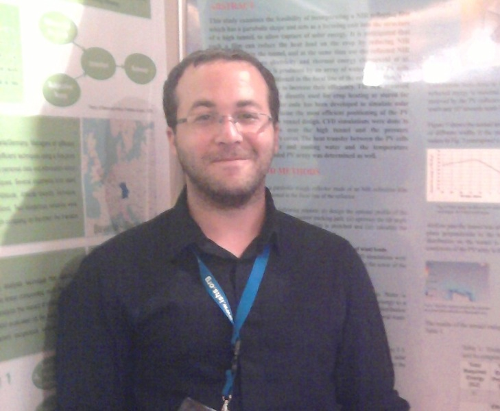

#### Updated in 2015

We all are **shocked and very sorry** to know about so abrupt and unexpected loss of Erez Wenger, our colleague in the
past, alumni of the laboratory. Erez started his M.Sc. thesis with our group, continued with Prof. Avi Kribus
and tragically passed away at the final stages of his thesis. He was a great man and excellent student. His family
received his M.Sc. degree diploma. The abstract of his work can be read from [PDF](https://www.eng.tau.ac.il/~kribus/Projects/ErezWenger-abstract.pdf)

#### Original info
Short bio on LinkedIn: [Erez Wenger](http://www.linkedin.com/pub/erez-wenger/23/891/3a3)

Erez project was devoted to measurements of temperature (a passive scalar) field and gradients in a heated turbulent jet. Using the laboratory unique [micro-machined sensors] to capture and analyze the fluctuation of velocity and temperature of a heated turbulent jet.

[micro-machined sensors]: ../research/microsensor.html)
