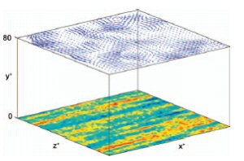
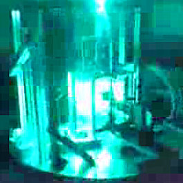

#### [XPIV](xpiv.html)

#### [Electronic tagging](tagging.html)

#### [PIV and IR](pivir.html)

#### [Rotating turbulence](rotating.html)

### Cooling electronics

An idea to use the unsteadiness of the flow in order to increase the heat transfer coefficient and thus improve the heat transfer rates is not new. We took this idea into the system which is typically poorly designed - the flat heat sink with the air fan cooling. This system is highly inefficient due to the stagnation zones inside the heat sink channels. Our method is improving the heat transfer efficiency of such systems by re-using the natural convection and better flow and heat transfer control.

<a href="research/cooling.html" class="button alt small">Learn more</a>

### Pulsating flows in compliant tubes

One of the central topics of our research is the complex, pulsating flows in three-dimensional and compliant enclosures. These flows are at the core of the biomedical applications such as aorta flow, mitral valves, stent designs, etc. We can provide a better view on the motion of the particulate or dissolved matter in such flows due to the three-dimensional partcile tracking velocimetry capabilities. We measure particle residence time, resistances of flexible complex geometries and wall shear stresses.

<a href="research/pulsating.html" class="button alt small">Learn more</a>

### Lid driven cavity

	Lid driven cavity (LDC) is one of the kernel cases in stability analysis. This is a great example of the flow in which the flow is stable at low Reynolds numbers and it is relatively easy to follow the evolution of the flow through a set of bifurcations until the transition to turbulence. We use the LDC flow in studies of particle resuspension under shear, mixing, instability and few practical applications.

 <a href="cresearch/avity.html"> <button type="button" class="btn btn-info btn-sm">More ...</button></a> 
